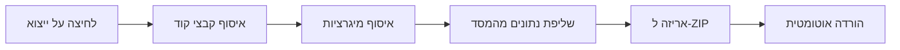

# ייצוא מלא של הפרויקט

## מה יכלול הייצוא

### קבצי קוד (כ-180 קבצים)
- כל קבצי TypeScript/React
- קבצי CSS ועיצוב
- Edge Functions
- קבצי הגדרות (package.json, vite.config.ts, eslint)

### קבצי מיגרציות (22 קבצים)
- כל קבצי ה-SQL שמגדירים את מבנה הטבלאות
- אינדקסים והרשאות RLS

### נתוני המסד (JSON)
- כל הכתבות והתוכן
- גלריות ותמונות
- אירועים וסרטונים
- הגדרות פרסום ומשתמשים
- סטטיסטיקות ואנליטיקס

---

## איך זה יעבוד



---

## מבנה קובץ ה-ZIP

```
project-export-2024-XX-XX.zip
├── src/                    # כל קוד הפרויקט
├── supabase/
│   ├── functions/          # Edge Functions
│   └── migrations/         # קבצי SQL
├── data/                   # נתוני המסד
│   ├── articles.json
│   ├── galleries.json
│   ├── events.json
│   └── ...
├── index.html
├── package.json
└── ...
```

---

## הערות חשובות

- הנתונים יישמרו בפורמט JSON קריא
- תמונות לא נכללות (הן מאוחסנות ב-Google Drive)
- הייצוא יכול לקחת כ-30 שניות עבור מסד גדול
